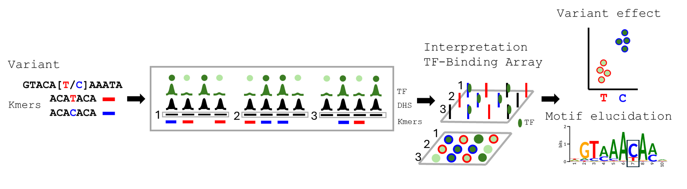

# EUchromatin binding array - EUbar

EUbar is a command-line toolkit for modeling sequence effects on transcription factor binding using accessible genomic regions as probes and region-level signal as intensity. It provides utilities to build k-mer occurrence indices, summarize signal over regions, run regression-based scans or SNV analyses, and perform seed-and-wobble motif discovery.



The package exposes a single umbrella command:

```bash
eubar <command> [args...]
```

## Available commands

- `array` — build a k-mer to region index from a BED file and genome FASTA
- `intensities` — compute per-region intensities from a BedGraph or BigWig signal track
- `scan` — scan a genomic region for motif effects using regression
- `snv` — evaluate motif effects for one or more SNVs
- `motifs` — perform seed-and-wobble motif discovery from probe intensities and the array file

## Installation

Clone the repository and install locally:

```bash
pip install .
```

Then confirm the CLI is available:

```bash
eubar --help
```

## Typical workflow

A common EUbar analysis has three stages:

1. **Build an array file** from accessible genomic regions.
2. **Compute probe intensities** from a matching signal track.
3. **Run analysis** with either `snv`, `scan`, or `motifs`.

### 1) Build the array file

Use `array` to scan each region in a BED file and record where each k-mer occurs.

```bash
eubar array \
  --bed regions.bed \
  --genome hg38.fa \
  --kmer-size 8 \
  --output regions_8mer.txt
```

Required inputs:

- BED file of accessible regions
- reference genome FASTA

Main output:

- array file mapping each k-mer to one or more genomic regions and offsets

### 2) Compute region intensities

Use `intensities` to summarize a signal track across the same regions.

```bash
eubar intensities \
  --bed regions.bed \
  --signal tf_signal.bw \
  --output probe_intensities.tsv
```

Required inputs:

- BED file used to define probes
- signal track in BedGraph or BigWig format

Main output:

- tab-delimited file with one region and one intensity value per line

### 3A) Run SNV analysis

Use `snv` to evaluate one or more variants in `chr:pos:ref>alt` format.

```bash
eubar snv \
  --intensities probe_intensities.tsv \
  --array regions_8mer.txt \
  --genome hg38.fa \
  --snv-list "chr5:1295113:C>T"
```

You can also provide a file of variants:

```bash
eubar snv \
  --intensities probe_intensities.tsv \
  --array regions_8mer.txt \
  --genome hg38.fa \
  --snv-list-file snvs.tsv
```

Useful options:

- `--mode nb` to use negative binomial regression instead of OLS
- `--best_pval` to report best-position summaries
- `--no-rand` to skip RAND regression
- `--output_long` to write a long-format TSV

### 3B) Run region scan analysis

Use `scan` to test motif effects across a genomic interval.

```bash
eubar scan \
  --intensities probe_intensities.tsv \
  --array regions_8mer.txt \
  --genome hg38.fa \
  --region chr5:1295105-1295140
```

Useful options:

- `--mode nb` to use negative binomial regression
- `--best_pval` for best-position summaries
- `--pooled` for pooled output mode
- `--save-figure scan_plot.png` to save a figure

### 3C) Run motif discovery

Use `motifs` to derive an affinity-associated motif from the probe intensity and array files.

```bash
eubar motifs \
  --intensities probe_intensities.tsv \
  --array regions_8mer.txt \
  --kmer-size 8 \
  --outdir motif_results \
  --prefix GABPA
```

Useful options:

- `--seed` to force a starting seed k-mer
- `--pretty-logo` for alternative logo styling
- `--no-combine-revcomp` to keep reverse complements separate
- `--top-n-report 50` to export the top-ranked k-mers

## Input formats

### BED regions

Used by `array` and `intensities`.

Expected format: standard BED intervals representing the accessible regions used as probes.

### Genome FASTA

Used by `array`, `scan`, and `snv`.

Expected format: reference genome in FASTA format.

### Array file

Produced by `array`; used by `scan`, `snv`, and `motifs`.

This file stores, for each k-mer, the regions in which it appears and the offset(s) within each region.

### Intensity file

Produced by `intensities`; used by `scan`, `snv`, and `motifs`.

Expected format: one region and one numeric intensity value per line.

### SNV list

Used by `snv`.

Expected format:

```text
chr5:1295113:C>T
chr8:128748315:G>A
```

## Notes

- `array` and `intensities` are intended to be run on matched region definitions.
- `scan`, `snv`, and `motifs` all depend on the array and intensity files generated upstream.
- Command-specific help is available with `eubar <command> --help`.
- Older argument names may still work as compatibility aliases, but the preferred public names are `--array` and `--kmer-size`.

## License

GNU General Public License v3.0.

## Citation

If you use **EUbar** in your research, please cite the associated manuscript when available.
