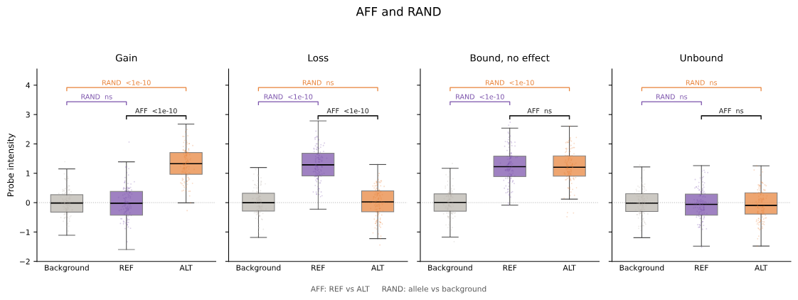

# SNV analysis

EUbar compares probe intensities for sequence contexts carrying different bases
at the queried position. This page uses the TERT promoter variants
`chr5:1295113:C>T` and `chr5:1295135:C>T` on hg38, with the MCF7 GABPA inputs
from [Data preparation](01_data_prep.md).

## Run an SNV analysis

```bash
eubar snv \
  --intensities results/GABPA_MCF7_intensities.tsv \
  --array results/MCF7_DNase_8mer.txt \
  --genome data/hg38.fa \
  --snv-list "chr5:1295113:C>T" \
  > results/tert_snv.tsv
```

SNV coordinates are **1-based**. Match the reference genome assembly and
chromosome names to your input files. Quote inline variants so the shell does
not interpret `>` as output redirection.

The default is an 8-mer analysis with OLS regression and RAND enabled. A variant
has eight overlapping sequence windows, each placing the changed base at a
different position. For each usable window, the full output reports AFF for the
requested ALT allele and RAND for REF and ALT. Missing or unsupported fits can
produce missing values or fewer rows.

| Column | Meaning |
| --- | --- |
| `snv` | Requested variant, `chr:pos:ref>alt` |
| `type` | `AFF` or `RAND`; see below |
| `allele` | Base being reported |
| `motif_pos` | Zero-based window start in the extracted SNV context; not a genomic coordinate or the changed base's index inside the window |
| `wildcard_kmer` | Sequence with `.` at the tested base; full-output RAND rows use `NA` |
| `effect` | Fitted coefficient: ALT versus REF for AFF; allele versus background for RAND |
| `pval` | P-value for that coefficient |

With the default residualized input and OLS fit, effects are on the input
intensity scale. They are not binding probabilities or fold changes. Positive
AFF indicates predicted gain relative to REF; negative AFF indicates loss.

## Understanding AFF and RAND

AFF asks whether the ALT sequence context has higher or lower probe intensity
than the REF context. RAND asks whether each allele context has higher intensity
than sampled background probes. Background probes exclude regions matched to
the queried SNV contexts. They come from the input probe universe, not from an
external collection of experimentally unbound sites.



*Illustration using synthetic probe intensities. Gray: background; purple: REF;
orange: ALT. Black brackets compare REF with ALT (AFF); colored brackets compare
each allele with background (RAND). The p-value labels illustrate these examples
and are not results from the GABPA tutorial data. “ns” means not significant in
the illustration. The boxplots explain the comparisons; EUbar fits regression
models rather than using the boxplot itself as a test.*

| Example | AFF | RAND | Interpretation |
| --- | --- | --- | --- |
| Gain | Positive ALT effect | ALT above background; REF need not be | Predicted gain of binding |
| Loss | Negative ALT effect | REF above background; ALT need not be | Predicted loss of binding |
| Bound, no effect | No clear REF–ALT difference | Both above background | Enrichment without a detectable allelic difference |
| Unbound | No clear REF–ALT difference | Neither above background | No enrichment detected in this analysis |

A significant **positive** RAND effect supports enrichment of that sequence
context across the probe collection. It does not establish occupancy at the
queried genomic locus. Likewise, a nonsignificant result is not proof of absence
of binding. Read the coefficient, p-value and probe support together.

Requiring both RAND alleles to be significant would exclude the gain and loss
examples above. A downstream filter can be stricter, but that is a separate
choice from EUbar's window-selection rule.

## Select one shared window

```bash
eubar snv \
  --intensities results/GABPA_MCF7_intensities.tsv \
  --array results/MCF7_DNase_8mer.txt \
  --genome data/hg38.fa \
  --snv-list "chr5:1295113:C>T,chr5:1295135:C>T" \
  --best-pval --holm --diagnostics \
  > results/tert_best.tsv
```

`--best-pval` ranks windows by the ALT AFF **p-value**, smallest first. Ties are
resolved by larger absolute effect, then window position. It selects the first
window where REF or ALT has positive RAND effect and RAND p < 0.05. With
`--holm`, that support check uses the adjusted RAND p-value.

**If no window passes RAND support, EUbar still returns the top AFF window.**
A row in the summary is therefore not automatically a supported binding call.
Selection does not itself require a significant AFF result.

The summary reports three rows at the same window: AFF ALT, RAND REF and RAND
ALT. Its columns start with `snv`, `type`, `allele`, `effect`, `pval`.
`--holm` adds `raw_pval`; `--diagnostics` adds:

| Column | Meaning |
| --- | --- |
| `motif_pos` | Selected window start in the SNV context |
| `wildcard_kmer` | Selected sequence context, also displayed on RAND rows |
| `n_probes` | Probe count in the reconstructed fit input; RAND includes background |
| `n_allele` | Probe count carrying the reported allele |

Diagnostics require `--best-pval`. Missing fits remain missing; do not convert
`NA` or `nan` into a nonsignificant p-value or zero effect.

### What Holm corrects

For each requested SNV, EUbar corrects two families separately:

- ALT AFF tests across windows, normally eight tests for an 8-mer.
- REF and ALT RAND tests together across windows, normally sixteen tests.

Only finite p-values enter the correction. The output `pval` becomes adjusted;
`raw_pval` retains the original value. This is **within-SNV** correction, not
correction across a variant list, TFs or datasets. `--holm` can also be used with
full SNV output, without `--best-pval`.

## Variant files and parallel runs

Save one variant per line in `data/snvs.txt`:

```text
chr5:1295113:C>T
chr5:1295135:C>T
```

```bash
eubar snv \
  --intensities results/GABPA_MCF7_intensities.tsv \
  --array results/MCF7_DNase_8mer.txt \
  --genome data/hg38.fa \
  --snv-list-file data/snvs.txt \
  --best-pval --holm --diagnostics --jobs 4 \
  > results/snvs.tsv
```

Use either `--snv-list` or `--snv-list-file`. `--jobs` defaults to 1 and parallelizes
across SNVs, preserving their output order. Workers consume additional memory.

## Masks and probe limits

A mask specifies matched bases and ignored spacer positions. Masked SNV runs
read probe sequences from the intensity-file coordinates and genome, so they do
not need an array file:

```bash
eubar snv \
  --intensities results/GABPA_MCF7_intensities.tsv \
  --genome data/hg38.fa \
  --mask 111100001111 \
  --snv-list "chr5:1295113:C>T" \
  --best-pval --holm --diagnostics \
  > results/tert_masked.tsv
```

This mask is an example of the syntax, not a recommendation for GABPA.
See [Masks and calibration](06_masks_and_calibration.md) for choosing a pattern,
interpreting its span, and setting `--max-probes`.

| Option | Default | Purpose |
| --- | --- | --- |
| `--kmer-size` | 8 | Contiguous k-mer size; match the array used |
| `--mask` | None | Explicit 0/1 mask; its span replaces k-mer size |
| `--rand-n` | 500 | Requested background probes per RAND window; availability can limit the sample |
| `--max-probes` | No cap | Approximate matched-probe budget per window, shared across allele groups |
| `--seed` | 0 | Matched-probe subsampling seed; does not replace RAND's deterministic sampling |
| `--jobs` | 1 | Number of SNV workers |

The older `--kmerPositions` and `--kmer_size` spellings remain accepted.
New commands in these docs use `--array` and `--kmer-size`. The best-window
CLI flag is `--best-pval`; `best_pval` is the Python/YAML field name.

Advanced compatibility options include `--mode ols|nb`, `--no-covariates`,
`--raw-lp`, `--no-rand` and `--debug`; some are hidden from normal help.
OLS is the default for residualized intensities. Negative-binomial mode is not
an interchangeable choice for signed residuals. `--no-rand` removes background
evidence and RAND rows; the summary then falls back to AFF ranking.

**Previous:** [Data preparation](01_data_prep.md) · **Next:** [Scan analysis](03_scan.md)
