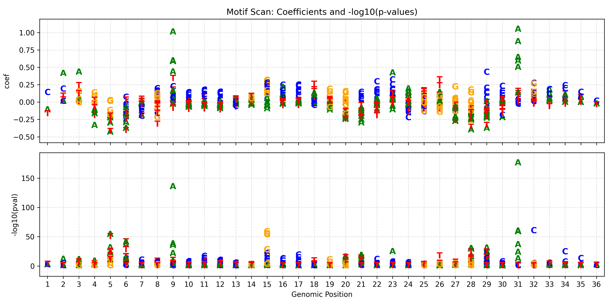
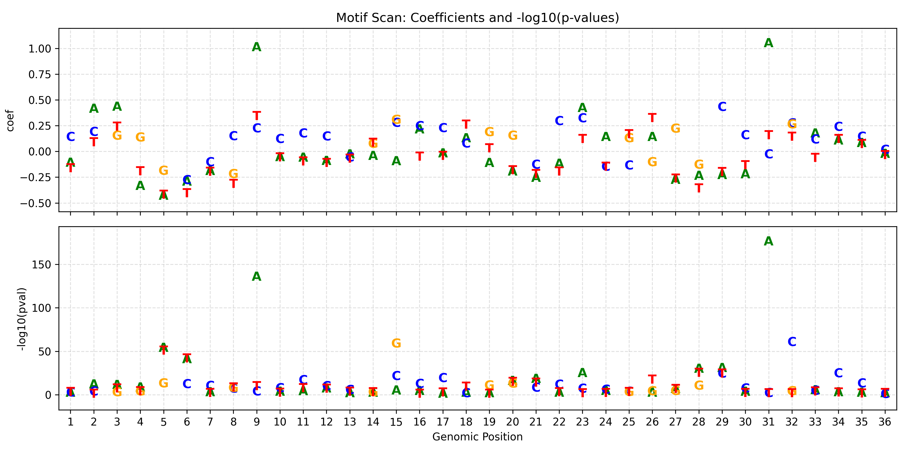

# Scan analysis

`eubar scan` evaluates substitutions across a genomic interval. Use the inputs
from [Data preparation](01_data_prep.md). Region coordinates are **1-based,
inclusive**: `chr5:1295105-1295140` contains 36 bases.

## Scan all windows

```bash
eubar scan \
  --intensities results/GABPA_MCF7_intensities.tsv \
  --array results/MCF7_DNase_8mer.txt \
  --genome data/hg38.fa \
  --region "chr5:1295105-1295140" \
  --save-figure results/tert_scan.png \
  > results/tert_scan.tsv
```

The ordinary scan fits AFF for each tested base in each k-mer window contained
within the requested interval. Boundary positions have fewer windows than
interior positions. OLS is the default. Reference-allele rows have missing
coefficients because REF is the comparison baseline.

| Column | Meaning |
| --- | --- |
| `wildcard_kmer` | Sequence with `.` at the tested base |
| `filled_kmer` | Sequence with the reported allele substituted |
| `window_index` | Zero-based window start in the scanned sequence |
| `snp_index` | Zero-based tested position within that window |
| `type` | `AFF` in ordinary scan output |
| `allele` | Reported base |
| `coef` | Effect relative to the reference allele |
| `pval` | P-value for that effect |
| `absolute_pos` | Zero-based offset in the scanned sequence, **not** a genomic coordinate |
| `method` | Fit method or missing-reference marker |

On the forward strand, genomic position is `region_start + absolute_pos`.
With `--reverse`, the sequence is reverse-complemented: genomic position is
`region_end - absolute_pos`, and alleles are reported on that strand.

## Ordinary best-window summary

Add `--best-pval` to retain the smallest positive, nonmissing p-value for each
position and allele. Ties favor the larger absolute coefficient. Different
alleles can select different windows. This mode does not run RAND or apply
multiple-testing correction.

```bash
eubar scan \
  --intensities results/GABPA_MCF7_intensities.tsv \
  --array results/MCF7_DNase_8mer.txt \
  --genome data/hg38.fa \
  --region "chr5:1295105-1295140" \
  --best-pval \
  --save-figure results/tert_scan_best.png \
  > results/tert_scan_best.tsv
```

The table retains the columns above and tags the method with `|best_pval`.
The existing TERT figures below illustrate the ordinary modes; they are not
Holm-adjusted results.

All windows:



Best window for each position and allele:



## Scan with RAND and within-SNV Holm correction

```bash
eubar scan \
  --intensities results/GABPA_MCF7_intensities.tsv \
  --array results/MCF7_DNase_8mer.txt \
  --genome data/hg38.fa \
  --region "chr5:1295105-1295140" \
  --best-pval --holm --diagnostics \
  --save-figure results/tert_scan_holm.png \
  > results/tert_scan_holm.tsv
```

This mode runs the SNV analysis for each of the three alternatives to each
reference base. It includes overlapping windows that extend **outside** the
requested interval, so sufficient FASTA flanking sequence is required. Its
runtime and results can differ from the ordinary best-window scan.

The output changes to the compact SNV schema:
`snv`, `type`, `allele`, `effect`, `pval`, `raw_pval`, followed by diagnostic
columns when requested. Each substitution normally has AFF ALT, RAND REF and
RAND ALT rows, chosen at one shared window. Coordinates in `snv` are genomic
and 1-based, including in reverse mode.

The [SNV selection and correction rules](02_snv.md#select-one-shared-window)
apply, including the fallback when no window has RAND support. Holm correction
is separate for each substitution; it does not correct across the interval.
The figure shows AFF effects, while RAND evidence remains in the table.

## Options and limits

| Option | Default | Scope |
| --- | --- | --- |
| `--kmer-size` | 8 | Must match the contiguous array |
| `--reverse` | Off | Reverse-complement sequence and allele orientation |
| `--max-probes` | No cap | Matched-probe subsampling for ordinary and Holm scans |
| `--seed` | 0 | Seed for that subsampling |
| `--rand-n` | 500 | Background sample size in Holm mode |
| `--diagnostics` | Off | Requires `--best-pval --holm` |
| `--save-figure` | None | Write an AFF plot |

`--holm` requires `--best-pval`. A custom `--rand-n`, `--no-rand`, or
`--diagnostics` also requires the combined mode. Scan currently accepts neither
`--mask` nor `--jobs`. To evaluate a masked interval, prepare a variant list and
use `eubar snv --mask`.

The retained advanced `--pooled` mode fits across windows rather than selecting
one. It cannot be combined with `--best-pval` or `--holm`, and its current path
does not apply `--max-probes`. It log-transforms its response, so it is not a
drop-in replacement for ordinary OLS on signed residuals. Other retained
controls are `--mode ols|nb`, `--no-covariates` and `--raw-lp`.

**Previous:** [SNV analysis](02_snv.md) · **Next:** [Motif discovery](04_motifs.md)
