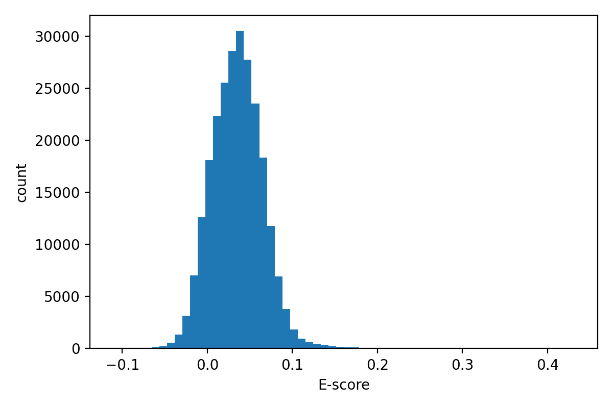
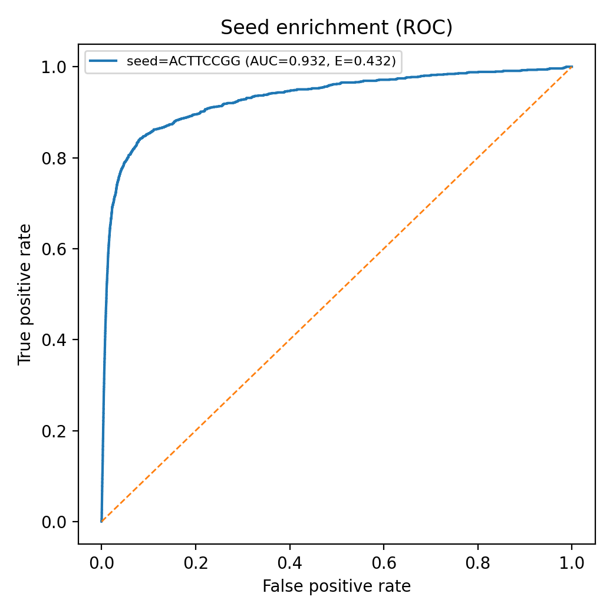
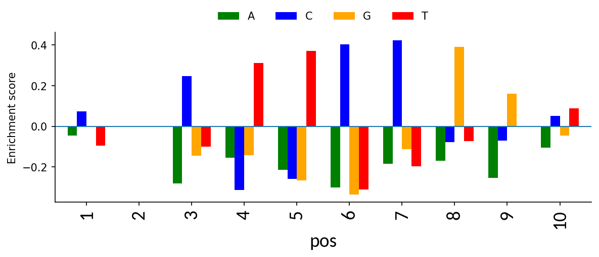
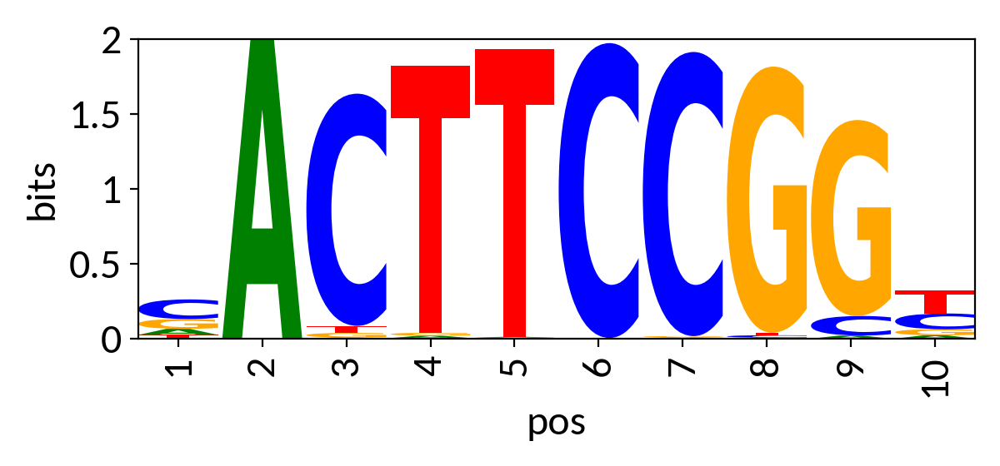
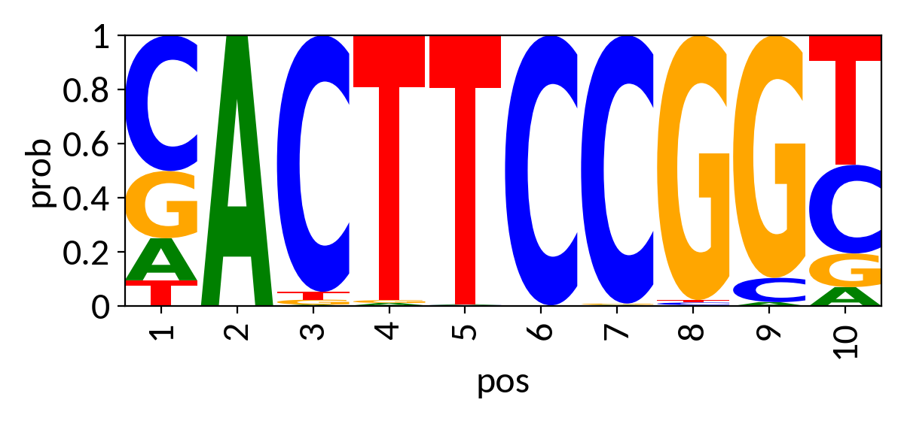

# Motif Discovery

This tutorial demonstrates how to use EUbar to derive an affinity-based TF binding motif directly from ChIP-seq probe intensities. Unlike frequency-based motifs that summarise aligned sequences within ChIP-seq peaks, EUbar motifs are built by learning which k-mer sequences are preferentially associated with higher binding intensity across the entire accessible genome.

We use the same MCF7 GABPA data from [Data Preparation](01_data_prep.md).

---

## 1. Run motif discovery

```bash
eubar motifs   --intensities results/GABPA_MCF7_intensities.tsv   --array results/MCF7_DNase_8mer.txt   --kmer-size 8   --outdir results/GABPA_motif   --prefix GABPA
```

EUbar will identify the highest-enriched seed 8-mer, refine base preferences at each position using enrichment scores, and extend the motif outward from the seed. All output files are written to the specified directory with the given prefix.

---

## 2. Output files

| File | Description |
|------|-------------|
| `GABPA.meme` | Motif in MEME format for use with downstream tools |
| `GABPA.ppm.tsv` | Position probability matrix as a tab-delimited table |
| `GABPA.reduced.tsv` | Base-specific enrichment scores per motif position |
| `GABPA.reduced_full.tsv` | Full enrichment table including extended flanking positions |
| `GABPA.top_escores.tsv` | Top-ranked k-mers by enrichment score used during seed selection |
| `GABPA.logo_bits.png` | Sequence logo scaled by information content (bits) |
| `GABPA.logo_prob.png` | Sequence logo scaled by base probability |
| `GABPA.logo_bits_rc.png` | Reverse complement logo (bits) |
| `GABPA.logo_prob_rc.png` | Reverse complement logo (probability) |
| `GABPA.reduced_enrichment.png` | Bar plot of base-specific enrichment scores per motif position |
| `GABPA.reduced_enrichment_rc.png` | Reverse complement enrichment bar plot |
| `GABPA.seed_roc.png` | ROC-style enrichment plot for the seed k-mer |
| `GABPA.seed_escore_hist.png` | Distribution of E-scores across all candidate k-mers |

---

## 3. Interpreting the output

### Seed selection

Before building the motif, EUbar scores all 65,536 possible 8-mers by their enrichment (E = AUC - 0.5) among highly bound probes. The distribution of E-scores is shown below. Most k-mers cluster near 0, with a small number of highly enriched sequences standing out.



The highest-scoring k-mer becomes the seed. For GABPA in MCF7, the seed is **ACTTCCGG** with E = 0.432, consistent with the known ETS-family core motif. The ROC plot below shows how well this seed separates highly bound probes from background (AUC = 0.932, E = 0.432):



The E-score is defined as AUC - 0.5, where AUC is computed by ranking all probes from highest to lowest intensity and measuring how well probes containing the seed k-mer are concentrated at the top of that ranking. An E-score of 0.432 indicates strong preferential enrichment of ACTTCCGG-containing probes among the most highly bound accessible regions.

### Base-specific enrichment scores

After seed selection, EUbar evaluates all four possible bases at each position of the motif, comparing probes containing each base against probes containing the other three. The enrichment score at each position reflects the relative preference for each base among highly bound probes.



Positions with a strongly dominant bar (one base clearly above the others) are highly informative positions of the motif. Positions where bars are small and mixed are low-information flanking positions.

### Sequence logos

The final motif is reported as a position probability matrix (PPM) and visualised as sequence logos. Two representations are available:

**Information content (bits) — highlights the most specific positions:**



**Base probability — shows all positions including low-specificity flanks:**



The recovered GABPA motif (CACTTCCGG) closely matches the canonical ETS-family binding sequence, with a highly conserved ACTTCCGG core and variable flanking positions.

### MEME format output

The motif is also exported in MEME format for direct use with FIMO, TOMTOM, or other tools from the MEME suite:

```
MEME version 4

ALPHABET= ACGT

strands: + -

MOTIF CACTTCCGGT
letter-probability matrix: alength= 4 w= 10 nsites= 10 E= 0
0.156 0.501 0.248 0.095
1.000 0.000 0.000 0.000
0.005 0.948 0.019 0.029
...
```

### The reduced_full table

`GABPA.reduced_full.tsv` is the underlying data behind the motif — it contains the base-specific enrichment scores at every position of the final motif, including the extended flanking positions. Each row represents one base at one position.

| Column | Description |
|--------|-------------|
| `step` | Extension step — 0 is the position closest to the seed, increasing outward |
| `side` | `core` = seed positions; `left` / `right` = extended flanking positions |
| `gaps_used` | Number of wildcard positions used when matching this k-mer |
| `base` | The base being evaluated at this position |
| `variant` | The full k-mer sequence with this base substituted at the tested position |
| `E_reduced` | Enrichment score (AUC - 0.5) comparing probes containing this base against probes containing the other three bases at this position |
| `p` | P-value for the enrichment (Mann-Whitney U approximation) |
| `F` | Number of foreground probes — probes containing this base at this position |
| `B` | Number of background probes — probes containing the other three bases |
| `IC` | Information content contribution of this position (bits); populated for flanking positions |
| `pos` | Absolute position in the final motif (0-based from seed start; negative = left flank) |

The `E_reduced` values at core positions are what get converted to base probabilities via softmax to produce the PPM. Positions where one base has a strongly positive `E_reduced` and the others are negative are highly specific positions of the motif. Flanking positions with low `E_reduced` values and low IC contribute little information and represent the degenerate edges of the motif.

---

## 4. Useful options

| Option | Description |
|--------|-------------|
| `--seed ACTTCCGG` | Force a specific seed k-mer instead of searching |
| `--top-n-report 50` | Export the top 50 k-mers by E-score to the TSV |

---

**Previous:** [Scan analysis](03_scan.md)
